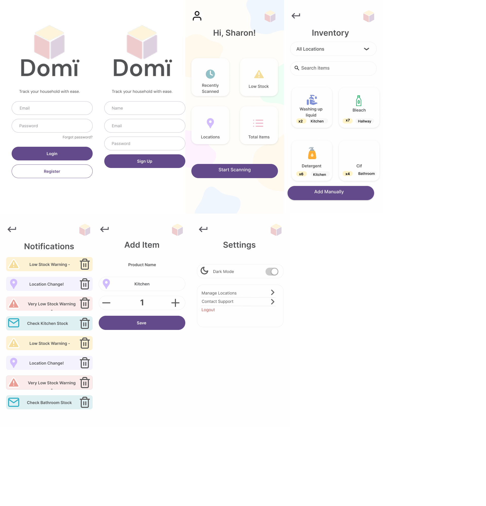
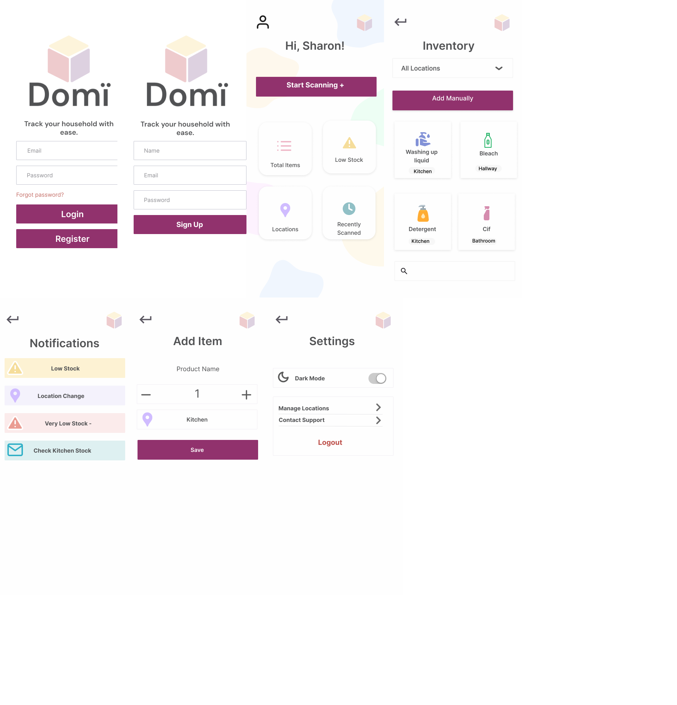

# Domï

**Domï** is an accessible inventory tracking app designed to help users manage household products with ease. It was inspired by my mum, who experienced a brain injury and found it difficult to remember what products she had and where they were stored. The app is designed with accessibility, simplicity, and clarity at its core.

>**Note:** This project is public for review purposes only. Please do not fork, copy or redistribute without permission.
>**Note:** This app uses a locally hosted FastAPI backend for barcode product lookup. Since this isn't deployed yet, the scanner will return "Product not found" when tested outside the local environment. All other functionality (login, register, add item manually, dynamic inventory listing, notification deletion, logout, SQLite) works fully.


---

## Table of Contents

- [Mockups](#mockups)
- [Accessibility Considerations](#accessibility-considerations)
- [Features](#features)
- [Tech Stack](#tech-stack)
- [Screens](#screens)
- [Roadmap](#roadmap)
- [Launch Plan](#launch-plan)
- [Conductrics Testing](#conductrics-testing)
- [Installation](#installation)
- [Developer Notes](#developer-notes)

---

## Mockups

### A vs B Comparison

| Mockup A (Final)                    | Mockup B (Discarded)                |
| ----------------------------------- | ----------------------------------- |
|  |  |

> **Why I chose A:**
> Mockup A uses a cleaner layout, improved color contrast, and stronger card-based structure. It reflects feedback from user with cognitive difficulties, who found it easier to follow visually and interact with.
> Mockup B had alignment and color contrast issues that didn’t pass WCAG testing.

---

## Accessibility Considerations

- Inspired by my mum’s traumatic brain injury and cognitive difficulties.
- Color palette and contrast tested against WCAG AA standards using tools like WebAIM (some pages still WIP).
- Simple layouts with minimal text, consistent iconography, and large tappable areas.
- All screens tested with screen readers.
- Fonts, spacing, and visual hierarchy refined for clarity and usability.

---

## Features

### ✅ Completed

- Register/Login with local SQLite storage (Android & iOS only)
- Dashboard with user greeting and quick access cards
- Barcode scanning (real on device, simulated on web)
- Add scanned or manual items with:
- Editable product name
- Quantity selector
- Location dropdown
- Inventory screen with dynamic filtering and search
- Persistent storage with SQLite
- Settings screen with logout and placeholder options
- Error handling and feedback via SnackBars
- Loading indicators for API calls
- Web support with graceful fallbacks for unsupported features

---

## Tech Stack

- **Frontend:** Flutter
- **State:** Stateful widgets (will consider Riverpod in future)
- **Backend:** FastAPI (local only for now)
- **Database:** SQLite (via `sqflite`), with `path_provider`
- **Other:** `mobile_scanner`, `http`, `logger`, and platform-specific workarounds

---

## Screens

- **Login / Register**
- **Dashboard** (with cards: Recently Scanned, Low Stock, Locations, Total Items)
- **Add Item** (via barcode or manually)
- **Inventory** (filter/search/save items)
- **Notifications** (WIP)
- **Settings** (includes Logout, placeholders for Dark Mode and Support)

---

## Roadmap

### Short-term

- [ ] Add password validation and strength feedback
- [ ] Implement profile page (avatar, email)
- [ ] Save user info to DB and greet dynamically on all devices
- [ ] Add reminder logic for notifications (6-week restock)
- [ ] Swipe-to-delete for inventory and notification cards

### Medium-term

- [ ] Replace placeholder API with proper product lookup service
- [ ] Enable cloud sync with Firebase
- [ ] Add dark mode toggle
- [ ] Add profile picture or emoji avatar support
- [ ] Enable Conductrics A/B tests (e.g. alternate layouts/colors)
- [ ] Implement NFC Sticker tagging tech
- [ ] Implement Firebase Analytics

### Long-term

- [ ] Multi-user support
- [ ] Share lists between users
- [ ] Launch on Google Play / App Store

---

## Launch Plan

**Planned Launch:**
**July 31st, 2025**

- App will be finalized with core features and dark mode support
- Testing with users from Headway Nottingham
- README and GitHub repo will be updated regularly as features are added

---

## Conductrics Testing

I plan to expand A/B testing through the Headway Nottingham group to evaluate:

- Light mode vs dark mode
- Layout preferences (e.g. icon placement, text sizes)
- Color palette legibility

---

## Installation

```bash
# Flutter dependencies
flutter clean
flutter pub get

# Run locally
flutter run -d chrome # for web - fully functional for demo/testing
flutter run -d emulator-5554 # Android emulator
```

> Note: Barcode scanning and SQLite login only work on Android/iOS. Web will simulate with placeholder data using test@test.com and Inventory97!. Known issues - emulator scaling

---

## Developer Notes

This project was built as part of my upskilling journey from frontend web to mobile Flutter dev.
It began as a personal project during my time at Experian and showcases my ability to:

- Learn new frameworks and languages
- Build responsive and accessible UIs
- Integrate frontend with APIs and local DBs
- Handle full-stack MVP development solo
- Design around real-world accessibility constraints

---

## License

Creative Commons BY-NC-ND 4.0 License

---

© 2025 Katie Cox
